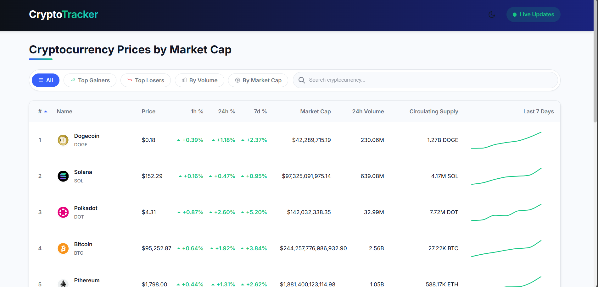

# 🚀 Real-Time Crypto Price Tracker

A modern, responsive **React + Redux Toolkit** application that displays real-time cryptocurrency prices using the Binance WebSocket API. It features advanced UI/UX, dark/light theme support, and dynamic filtering for an optimal user experience.



---

## 🌟 Features

- 🔴 **Live Price Updates** – Real-time data streaming of top 10 cryptocurrencies via Binance WebSocket API.
- 💡 **Light & Dark Mode** – Smooth transitions with system preference detection and toggle support.
- 🧠 **Advanced Filtering & Sorting**
  - Filter top gainers and losers  
  - Search by coin name or symbol  
  - Sort by price, volume, or market cap
- 📈 **Visual Enhancements**
  - Color-coded price change indicators  
  - Mini 7-day trend charts  
  - Interactive hover effects
- 🔧 **UX Enhancements**
  - Scroll-to-top button  
  - Smooth scrolling animations
- 💾 **Persistent Preferences** – Save theme, filters, and sorting in localStorage.
- 📱 **Fully Responsive** – Optimized for all screen sizes.

---

## 🛠️ Tech Stack

- **React 19** with Hooks  
- **TypeScript** – Strong type safety  
- **Redux Toolkit** – Centralized state management  
- **Styled Components** – Dynamic theming  
- **Chart.js + react-chartjs-2** – Interactive charts  
- **WebSocket API** – Real-time price streaming  
- **Context API** – Lightweight theme state handling  
- **Jest** – Unit testing framework  
- **LocalStorage** – Persistent user settings

---

## 🚀 Getting Started

### Prerequisites

- Node.js v14 or higher
- npm or yarn

### Installation

```bash
# Clone the repository
git clone https://github.com/Rajnikant9835/crypto-tracker.git

# Navigate to the project folder
cd crypto-tracker

# Install dependencies
npm install

# Start the development server
npm start
